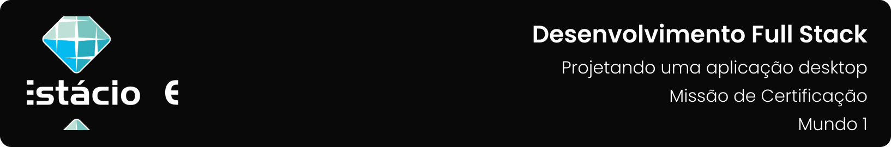

---

[Projeto](#-projeto) • [Funcionalidades](#-funcionalidades) • [Como baixar e executar](#-como-baixar-e-executar) • [Tecnologias utilizadas](#-tecnologias-utilizadas) • [Autores](#-autores) • [Licença](#-licença)

---

## 📋 Projeto
Aplicação para gerenciamento de ferramentas em um ambiente de produção de conteúdo audiovisual de grande porte, apresentada como parte da **`Misssão de Certificação: Projetando uma Aplicação Desktop`** do **`Mundo 1`** do curso de **`Desenvolvimento Full Stack`** da [**`Estácio`**](https://estacio.br/formulario?cod_agente=14369444&u=177546), do semestre de **`2022.4`** utilizando a linguagem de programação Python.

## 🗃 Funcionalidades
- Cadastro e consulta de ferramentas
- Cadastro e consulta de técnicos
- Cadastro e consulta de reservas
- Impressão das reservas

## 📥 Como baixar e executar
Para baixar os arquivos deste repositório, você deve ter o [GitHub](https://github.com/) instalado em seu dispositivo.

Após instalado, você deverá acessar a guia `Arquivo` → `Clonar repositório` → `URL` e incluir o caminho `guedesert/projetando-uma-aplicacao-desktop`.

Além disso, é interessante que você tenha um bom IDE para trabalhar com os códigos, dos quais eu recomendo o uso do [PyCharm](https://www.jetbrains.com/pt-br/pycharm), [Visual Studio Code](https://code.visualstudio.com/) ou [Pydroid 3](https://play.google.com/store/apps/details?id=ru.iiec.pydroid3), sendo este último um ambiente para dispositivos Android.

## 🛠 Tecnologias utilizadas
Para a construção e execução do projeto foram utilizadas as seguintes tecnologias:
- Linguagem:
  - [Python](https://www.python.org/)
- Bibliotecas:
  - tkinter
- IDEs:
  - [PyCharm](https://www.jetbrains.com/pt-br/pycharm/)
  - [Visual Studio Code](https://code.visualstudio.com/)
- Geração de imagens:
  - [Figma](https://www.figma.com/)

## 👥 Autores
Dev Team #

[Emanuel Roseira Guedes](https://github.com/guedesert)
- **Matrícula:** 202212181407

## 📃 Licença
Este repositório está licensiado sob a [Licença MIT](./LICENSE).

